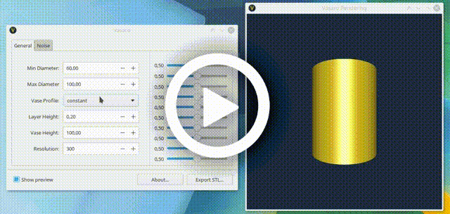

# Vasaro [](https://paypal.me/andreafontana/10) [](https://patreon.com/vasaro/)

[IPA](https://en.wiktionary.org/wiki/Wiktionary:International_Phonetic_Alphabet): /va'zarɔ/  
Italian archaic form of *vasaio* - a person who makes ceramic ware (i.e. "potter")


## How it works

[](https://www.youtube.com/watch?v=HkYo8WCW9jM)


## Where can I download it?
Vasaro is free, licensed under GPLv3.  
It works on all major platforms (linux, windows, macOS).  
Pre-compiled binaries (x64) for windows are available [here](http://github.com/trikko/vasaro/releases).

## Support vasaro development!
Vasaro is open source. Project is developed on a voluntary basis.  
You can support the development of vasaro in many ways:
* Donating using [paypal](https://www.paypal.me/andreafontana/10) or [patreon](https://patreon.com/vasaro/) 
* Giving me some bitcoins, why not?  (wallet: 38KUap5bVU8DQJjEepwX8NDG2wdvhGSMzb)
* Publishing your designs and tagging them "made with vasaro"
* Spreading the word
* Testing vasaro: create new issues if it does not work properly
* Sending a pull-request to improve vasaro

## How to build vasaro from scratch
Vasaro is written in [D programming language](https://dlang.org).  
Do you know C++, Java, etc? D is like those, just better.

You can use any D compiler, but to get the best performance out of your machine you should probably download and install the latest ldc's release from [https://github.com/ldc-developers/ldc/releases](https://github.com/ldc-developers/ldc/releases).

Vasaro depends on two libraries:
* [SDL2](https://www.libsdl.org/)
* [GTK+3](https://www.gtk.org/)

### Building instructions for **macOS**

Using homebrew ([check this](https://brew.sh/)) is the easiest way:

```bash
brew install gtk+3 sdl2 ldc dub adwaita-icon-theme
```
Build:
```bash
dub --build=release-nobounds --compiler=ldc2
```
If you want to create a bundle and install vasaro:
```bash
/bin/sh ./createMacOSBundle.sh
```

### Building instructions for **Ubuntu/Debian**

Please be sure to have the [latest dmd](https://dlang.org/download.html#dmd) version installed. Often official repositories have an outdated version.  
For debian/ubuntu/mint/etc [an unofficial apt repository](https://d-apt.sourceforge.io/) is available with latest dmd compiler.

Install required dependencies:
```bash
sudo apt update
sudo apt install libgtk-3-dev libsdl2-dev  
```

Build:
```bash
dub --build=release-nobounds
```

### Building instructions for **Windows**

On Windows console:
```bash
dub --build=release-nobounds --compiler=ldc2
```

Then extract [this file](https://www.libsdl.org/release/SDL2-2.0.9-win32-x64.zip) into vasaro directory. Install [this package](https://github.com/tschoonj/GTK-for-Windows-Runtime-Environment-Installer/releases) to add gtk+3 library to your pc.


## Planned features

A number of features are already planned: from [bump mapping](https://en.wikipedia.org/wiki/Bump_mapping) using a user-provided image to simple tasks such as loading & saving your vase project. Implementation of new features depends on the community interest and contribution.
